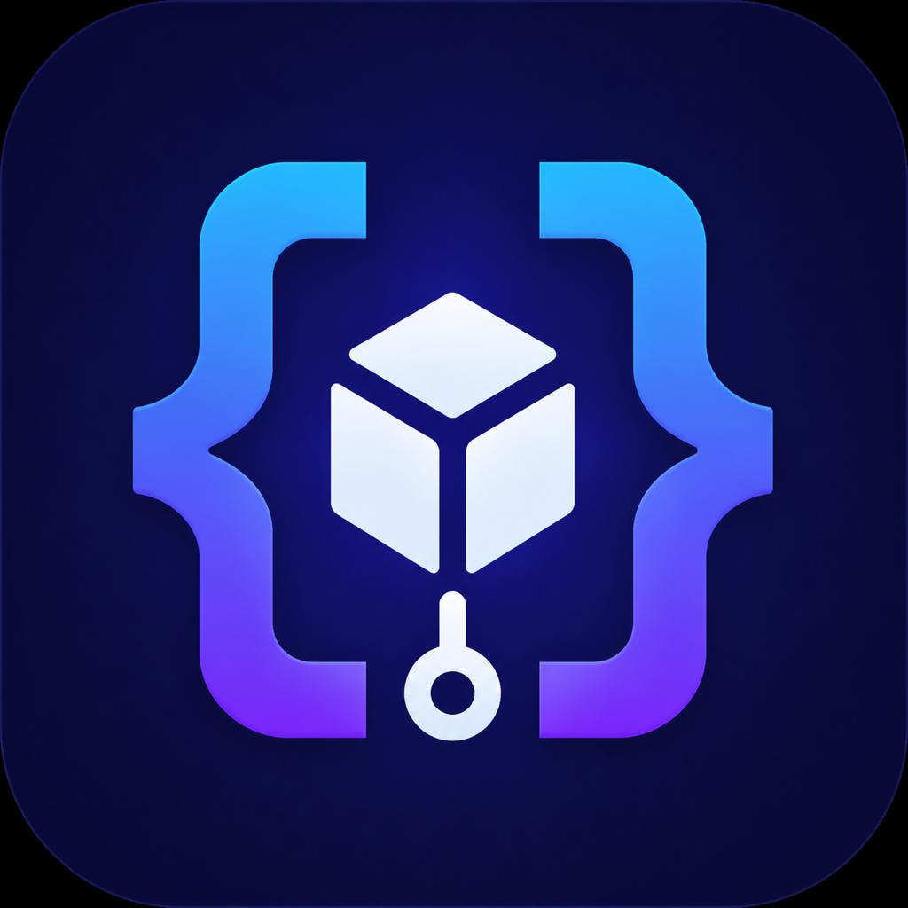
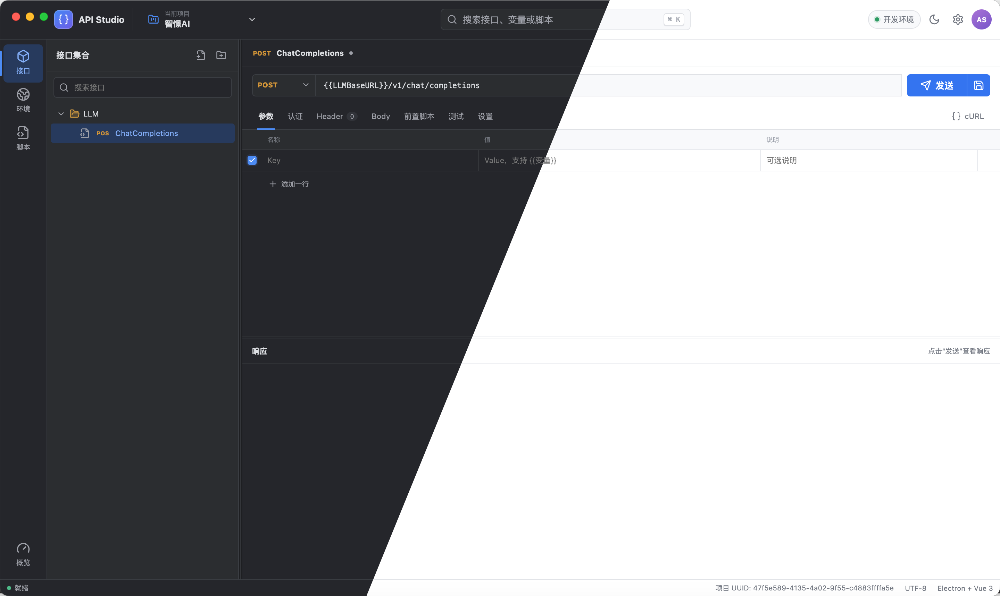
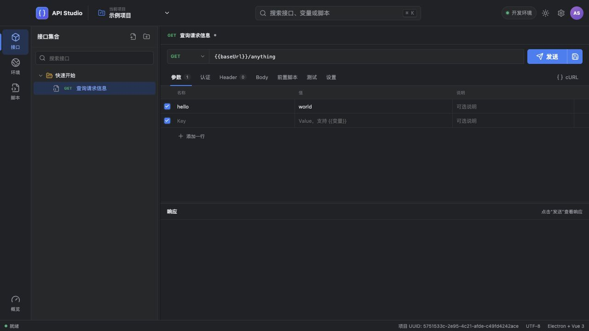
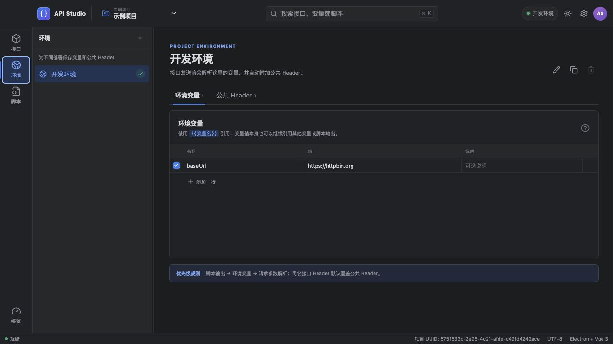
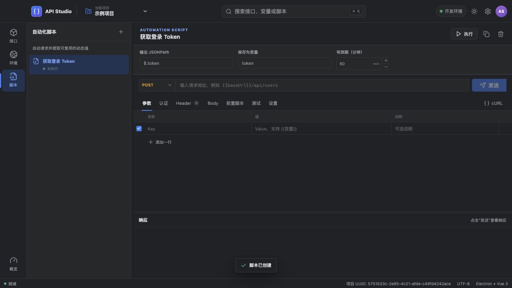
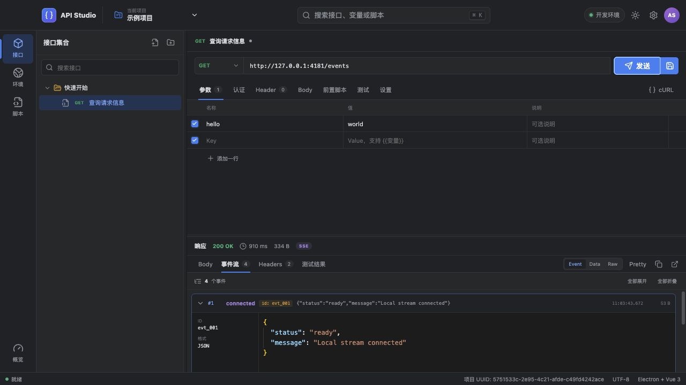
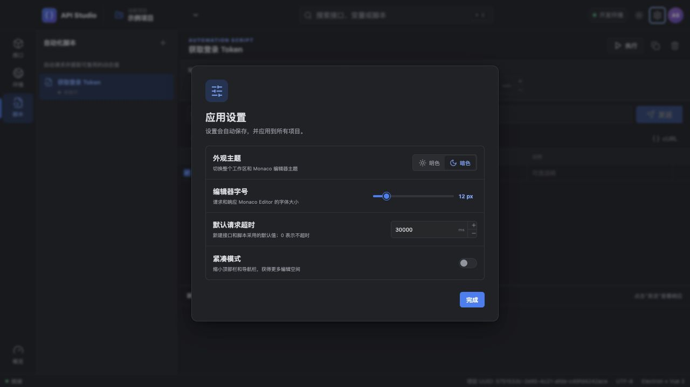

<div align="center">

# API Studio

**一款具有 IDE 使用体验、本地优先的 API 调试工作台。**

无需把工作区交给云服务，也能组织、调试、自动化并深入检查 HTTP API。



[English](./README.md) · [功能介绍](#功能介绍) · [界面预览](#界面预览) · [快速开始](#快速开始)



[](#数据不上云)
[](https://www.electronjs.org/)
[](https://vuejs.org/)
[](https://www.typescriptlang.org/)
[](https://microsoft.github.io/monaco-editor/)

</div>

API Studio 是一款使用 Electron + Vue 3 构建的桌面接口调试工具。它采用紧凑的 IDEA 风格界面，将项目、环境、自动化脚本、接口请求和响应检查放在同一个专注的工作区中，同时支持普通 HTTP 请求、文件上传、标准 SSE 与非标准数据流。

它最重要的设计原则很简单：**你的工作区不是一个在线账号**。项目数据保存在当前设备上，只有在你主动导入或导出时才会移动。API Studio 不要求登录，不依赖云端同步，也不需要托管工作区。

> [!IMPORTANT]
> “本地优先”指 API Studio 工作区数据的存储方式。你主动发送的请求仍然会访问目标 API，其数据安全取决于目标服务和你所在的网络环境。

## 为什么选择 API Studio？

- **默认保护隐私**：接口定义、环境、脚本和请求集合均留在本机。
- **IDE 式操作体验**：紧凑桌面布局、项目切换器、可搜索接口树、可拖拽分栏以及自动记忆的区域尺寸。
- **真正的流式响应支持**：实时检查标准 SSE、`data:` 行流、NDJSON、JSON Sequence 和任意原始文本流。
- **可复用的自动化能力**：将登录或初始化接口变成脚本，提取 JSON 值，设置有效期缓存，并在环境变量中直接引用。
- **面向调试与阅读**：请求和响应由 Monaco Editor 提供高亮与格式化能力，同时展示响应元数据、测试结果及 cURL。
- **统一的跨平台视觉**：提供明色和暗色主题；菜单、下拉框、开关、单选框、复选框、滑块和滚动条均采用统一的自绘样式。

## 功能介绍

### 项目与可移植数据

- 每个项目拥有独立 UUID，接口、环境、变量、公共 Header 和脚本互不干扰。
- 可从顶部项目菜单新建、切换、重命名、复制、删除、导入和导出项目。
- 当前项目可导出为易读的 `.api-studio.json` 文件。
- 支持一次导入多个项目；出现重名时自动命名为 `项目名 (1)`、`项目名 (2)`，同时继续保持数据隔离。
- 启动时会检测并迁移已有的 API Forge 本地工作区数据。

### 接口集合

- 使用支持嵌套目录的树形结构整理接口，并可快速搜索。
- 支持新建、重命名、递归复制、移动和删除目录或接口。
- 可配置请求方法、URL、Query 参数、认证、Header、Body、前置脚本、测试脚本以及单接口设置。
- 支持 Bearer Token、Basic Auth，以及写入 Header 或 Query 的 API Key。
- 支持 JSON、纯文本、`application/x-www-form-urlencoded` 和 `multipart/form-data`。
- 文件上传支持多选、自定义字段名，并可与普通 multipart 文本字段一同发送。
- 每个请求可单独控制超时、重定向、证书校验和流解析模式。

### 环境、变量与公共 Header

- 每个项目可创建多个环境，并在应用顶部快速切换当前环境。
- 使用 `{{变量名}}` 引用环境变量，同时支持嵌套变量解析。
- 集中配置 `Authorization`、租户 ID、链路 ID、内容协商等公共 Header。
- 接口 Header 与公共 Header 同名时，可明确选择覆盖公共值，或作为重复 Header 一并传入。
- 环境值可以引用自动化脚本产生的结果，让缓存的登录 Token 被整个环境中的接口复用。

### 自动化脚本

脚本是一种能够将响应自动转换为可复用值的特殊接口。典型场景是执行登录请求，从返回 JSON 的 `data.token` 中提取 Token，再提供给当前环境使用。

- 每个项目可创建并复用多个脚本。
- 脚本请求复用普通接口的完整请求工作区。
- 可通过路径从 JSON 响应中选择某个字段或完整对象。
- 可为提取结果指定变量名，并通过 `{{名称}}` 引用。
- 可配置缓存有效期，避免频繁重复执行登录或初始化请求。
- 即使缓存仍在有效期内，也可以随时手动刷新脚本结果。

### Monaco 编辑与脚本测试

- JSON/文本 Body、前置脚本、测试脚本和响应内容均使用 Monaco Editor。
- 前置脚本提供 `pm.environment`、`pm.variables` 和 `pm.request`。
- 测试脚本提供 `pm.response`、`pm.test` 和精简的 `pm.expect` API。
- 请求完成后逐项展示测试通过或失败状态。
- 可在设置中调整 Monaco 字号和其他工作区偏好。

```javascript
// 前置脚本
pm.environment.set('timestamp', Date.now())
```

```javascript
// 响应测试
pm.test('状态码为 200', () => {
  pm.expect(pm.response.code).to.equal(200)
})
```

> API Studio 提供精简的 Postman 风格脚本能力，但并不是完整 Postman Runtime API 的兼容实现。

### HTTP 与流式响应

- 桌面版通过 Electron 主进程发送请求，不受浏览器 CORS 限制。
- 可查看状态码、耗时、响应大小、最终 URL、Header、格式化 Body、原始 Body 和自动生成的 cURL。
- 流式请求进行中可随时停止，无需关闭工作区。
- 可自动判断流式响应，也可在服务端 Content-Type 不规范时强制指定解析方式。
- 完整解析标准 SSE 的 `event`、`data`、`id` 和 `retry` 字段。
- 支持仅含 `data:` 的行流、NDJSON/JSON Sequence 以及任意原始文本分块。
- 支持事件卡片、数据视图和原始视图；事件卡片可展开/折叠，并会自动格式化 JSON 数据。

## 界面预览

### 接口请求工作区

接口树与请求/响应工作区采用紧凑的桌面布局。主要分隔区域均可拖拽调整，尺寸会自动记忆。



### 环境变量与公共 Header

集中管理环境变量和公共 Header；接口可对同名 Header 明确选择覆盖或重复传入。



### 可复用自动化脚本

构建登录与初始化请求，提取 JSON 值，配置有效期缓存，并按需手动刷新。



### 图形化 SSE 检查

流事件会实时增量显示为可展开卡片，事件名称、ID、时间、数据类型和格式化内容清晰可读。



### 设置与主题

在实际可用的设置面板中切换主题、调整 Monaco 字号、设置默认请求超时以及工作区密度。



## 数据不上云

API Studio 没有账号系统，也没有云端工作区。Electron 应用会将整个工作区以本地 JSON 文档的形式保存在 Electron 对应平台的 `userData` 目录；仅用于开发的浏览器预览模式会使用浏览器本地存储。

| 数据或操作 | 数据去向 |
| --- | --- |
| 项目、接口树、环境和脚本 | 本机应用数据目录 |
| 分栏尺寸和界面偏好 | 本机应用/浏览器存储 |
| 导出的项目 | 仅写入用户主动选择的文件位置 |
| 导入的项目 | 仅从用户主动选择的文件读取 |
| HTTP 请求内容 | 用户指定的目标接口 |

项目中不包含同步后端或遥测客户端。如果项目中保存了密钥，请像保护 `.env` 文件一样保护导出的 JSON：不要将其提交到公开仓库、公开分享或以未加密形式存储在不可信位置。

## 快速开始

### 环境要求

- Node.js 22.12 或更高版本
- npm

### 开发模式运行

```bash
git clone https://github.com/onlyguo/api-studio.git
cd api-studio
npm install
npm run dev
```

### 构建并运行桌面版

```bash
npm run build
npm start
```

也可以执行 `npm run preview` 启动浏览器预览。该模式下请求由浏览器 `fetch` 发送，因此仍受 CORS 限制；正常接口调试和文件路径上传建议使用 Electron 桌面版。

## 自动构建与发布

推送任意 Git 标签后都会自动启动 [发布工作流](./.github/workflows/release.yml)。`v0.1.0`、`beta`、`nightly-2026-07-28` 以及包含 `/` 的标签都可以使用。全部任务成功后，GitHub Actions 会创建 Release、附带 SHA-256 校验文件，并发布以下安装包：

- 同时支持 Intel 与 Apple Silicon 的 macOS 通用 DMG 和 ZIP；使用 Developer ID 签名、提交 Apple 公证并装订公证票据
- Windows x64 NSIS 安装程序
- Linux x64 AppImage 和 Debian 安装包

macOS 签名信息缺失时，工作流会主动失败，不会悄悄发布未签名版本。请在仓库的 **Settings → Secrets and variables → Actions** 中配置：

| Secret | 内容 |
| --- | --- |
| `APPLE_CERTIFICATE` | Developer ID Application `.p12` 证书的 Base64 内容 |
| `APPLE_CERTIFICATE_PASSWORD` | 导出 `.p12` 时设置的密码 |
| `APPLE_TEAM_ID` | Apple Developer Team ID |
| `APPLE_ID` | 加入 Apple Developer Program 的 Apple ID |
| `APPLE_PASSWORD` | Apple ID 的应用专用密码，不是账号登录密码 |

```bash
# macOS：分别复制编码结果并保存到对应的 GitHub Secret
base64 -i DeveloperIDApplication.p12 | pbcopy
```

可以使用任意名称创建发布标签：

```bash
git tag nightly-2026-07-28
git push origin nightly-2026-07-28
```

标签名称决定 GitHub Release 的名称；应用和安装包内部版本仍取自 `package.json`，因为桌面安装包格式要求合法的应用版本。不要把证书或密码提交到仓库。electron-builder 会把 `APPLE_CERTIFICATE` 导入自己管理的临时钥匙串，因此当前的 `KEYCHAIN_PASSWORD` 不需要被工作流读取；`APPLE_PASSWORD` 必须是在 appleid.apple.com 创建的应用专用密码，而不是 Apple ID 登录密码。

## 技术栈

| 层级 | 技术 |
| --- | --- |
| 桌面运行时 | Electron 43 |
| 应用界面 | Vue 3 + TypeScript |
| 构建工具 | Vite 6 |
| 代码与数据编辑 | Monaco Editor |
| 图标 | Lucide |
| 持久化 | Electron `userData` 本地 JSON / 浏览器本地存储 |

## 项目状态

API Studio 当前版本为 `0.1.0`，仍在持续开发中。现有工作区已经可以使用，但在稳定版发布之前，项目导出格式和精简脚本 API 仍可能演进。早期版本升级时，请备份重要的项目导出文件。

## 参与贡献

欢迎提交 Issue 和 Pull Request。反馈问题时，请附上操作系统、问题出现在 Electron 还是浏览器预览中，以及已移除敏感信息的最小复现请求。

- [项目源码](https://github.com/onlyguo/api-studio)
- [问题反馈](https://github.com/onlyguo/api-studio/issues)

---

<div align="center">
为希望拥有完整 API 工作区、又不愿把工作区交给云端的开发者打造。
</div>
